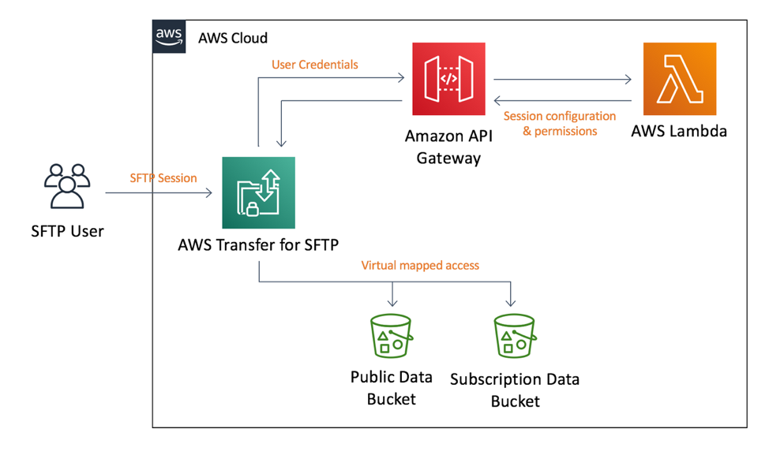

# Transfer for SFTP - Logical Directory demonstration

This sample code demonstrates how to configure per-user logical directory configurations as part of a custom identity provider for use with the 
AWS Transfer for SFTP service.  To see the sample in action you can deploy the code into your AWS account now using one of the buttons below or you
can clone this repository and explore the code for yourself.

This repository contains the following files:
```
├── README.md
├── cloudformation
│   ├── main.yaml               <-- CloudFormation to deploy S3 buckets, an SFTP server, and identity provider
│   ├── sftp_idp.yaml           <-- CloudFormation to provision custom identity provider
│   └── sftp_server.yaml        <-- CloudFormation to provision Transfer for SFTP server
└── src
    ├── authorizor
    │   └── lambda.js           <-- custom identity provider, responsible for configuring logical directories
    └── datagen
        └── lambda_function.py  <-- custom resource to generate sample data, part of cloudformation
```

## License Summary

This sample code is made available under the MIT-0 license. See the LICENSE file.

## Getting started

1. To see the demonstration in action deploy the custom identity provider using the CloudFormation provided or deploy the CloudFormation into your AWS account now using the buttons below.

| Region | Launch Template |
|---|:---:|
| Ireland (eu-west-1) | [](https://console.aws.amazon.com/cloudformation/home?region=eu-west-1#/stacks/create/review?stackName=logical-directory-demo&templateURL=https://s3.amazonaws.com/transfer-for-sftp-logical-directories-eu-west-1/logical-directories.yaml) |
| London (eu-west-2) | [](https://console.aws.amazon.com/cloudformation/home?region=eu-west-2#/stacks/create/review?stackName=logical-directory-demo&templateURL=https://s3.amazonaws.com/transfer-for-sftp-logical-directories-eu-west-2/logical-directories.yaml) |
| N. Virginia (us-east-1) | [](https://console.aws.amazon.com/cloudformation/home?region=us-east-1#/stacks/create/review?stackName=logical-directory-demo&templateURL=https://s3.amazonaws.com/transfer-for-sftp-logical-directories-us-east-1/logical-directories.yaml) |
| Oregon (us-west-2) | [](https://console.aws.amazon.com/cloudformation/home?region=us-west-2#/stacks/create/review?stackName=logical-directory-demo&templateURL=https://s3.amazonaws.com/transfer-for-sftp-logical-directories-us-west-2/logical-directories.yaml) |
| Sydney (ap-southeast-2) | [](https://console.aws.amazon.com/cloudformation/home?region=ap-southeast-2#/stacks/create/review?stackName=logical-directory-demo&templateURL=https://s3.amazonaws.com/transfer-for-sftp-logical-directories-ap-southeast-2/logical-directories.yaml) |

**Or using the AWS CLI...**

```bash
$ aws cloudformation package --template-file cloudformation/main.yaml --s3-bucket YOUR-CLOUDFORMATION-BUCKET-NAME --output-template-file packaged.yaml   
$ aws cloudformation deploy --template-file packaged.yaml --stack-name sftp-demo --capabilities CAPABILITY_IAM --parameter-overrides StackId=logical-demo
```

2. Once the CloudFormation template has finished deploying visit the [AWS Transfer for SFTP console](https://console.aws.amazon.com/transfer/home) and open the details page for your new SFTP server.  Make a note of the `Endpoint` URI.

2. Then using your preferred SFTP client open a connection to the SFTP server:

```bash
sftp alice@s-123abcca122e420c8.server.transfer.eu-west-2.amazonaws.com
```

The custom identity provider is configured for the following users:

| Username | Password |
|---|:---:|
| alice | Password01 |
| bryan | Password02 |

Once logged in you should see one of the following directory structures:
> Alice
```
/
├── public
│   └── research      --> s3://public-research
│       └── global   
└── subscribed
    ├── 2018
    │   └── indices   --> s3://subscriptions/historical/2018/indices
    └── 2019
        ├── indices   --> s3://subscriptions/historical/2019/indices
        └── equities  --> s3://subscriptions/historical/2019/equities   
```

> Bryan
```
/
├── public
│   └── research      --> s3://public-research
│       └── global
└── subscribed
    ├── 2018
    │   ├── equities  --> s3://subscriptions/historical/2018/equities
    │   └── indices   --> s3://subscriptions/historical/2018/indices
    └── 2019
        ├── credit    --> s3://subscriptions/historical/2019/credit
        └── equities  --> s3://subscriptions/historical/2019/equities
```

> Please note the actual S3 bucket names will be specific to your CloudFormation deployment.

You can log into the SFTP server and observe the user experience for both Alice and Bryan. Please also experiment with the custom identity provider by accessing its source code from the AWS Lambda console.  Try giving Alice and Bryan permissions to write files as well as read files, try mapping additional buckets to other parts of the file system, experiment with different permutations to align the identity provider more with your use case.  

## About the CloudFormation
There are two stacks deployed as part of an over-arching stack defined by main.yaml.  This top level stack creates 2 Amazon S3 buckets for use by the SFTP server and then creates 2 nested stacks.  The first nested stack creates a Lambda function fronted by an API Gateway, this will act as a custom identity provider for our SFTP server.  The next nested stack will provision the Transfer for SFTP server leveraging the custom IDP.

The CloudFormation templates create an architecture which is made up of four key components. As shown in the diagram below they are the AWS Transfer for SFTP server, Amazon API Gateway, AWS Lambda, and two S3 buckets for the data repository.



 When a user opens a connection to AWS SFTP, the service will forward the user’s credentials to a custom identity provider which is fronted by an API method implemented using Amazon API Gateway. The API Gateway passes the user credentials and server details to an AWS Lambda function to authenticate and authorize the user.

The AWS Lambda function will attempt to authenticate the user and if authentication is successful, it will return a JSON object describing the user’s SFTP session. The JSON object includes the IAM role and an optional scope-down policy that governs the user’s access to one or more S3 buckets. It also describes the folder structure the user will see and how those folders map to S3 bucket paths. The JSON document is returned to the AWS SFTP server which then maintains a session with the user, handling SFTP commands such as get, ls, and put.


## About the custom IDP
The identity provider is a Lambda function which is responsible for determining if the user is first authenticated and then how the user should be authorized.  After authentication the Lambda function should respond with an IAM policy and virtual mapping to be used by the Transfer for SFTP service.  This IAM policy is a scope down policy meant to grant user-specific permissions as a subset of the role granted to the user.  

All Lambda functions have an entry-point, called a “Handler,” which is where execution of the Lambda function begins. Below is the code for our handler:

```javascript
exports.handler = (event, context, callback) => {
    console.log("Event:", JSON.stringify(event));

    var response = {};

    if (authenticated(event.username, event.password)) {
        var scopeDownPolicy = getScopeDownPolicy(event.username);
        var directoryMapping = getDirectoryMapping(event.username);

        response = {
            Role: userRoleArn,
            Policy: JSON.stringify(scopeDownPolicy),
            HomeDirectoryType: "LOGICAL",
            HomeDirectoryDetails: JSON.stringify(directoryMapping)
        };
    }

    console.log("Returning ", JSON.stringify(response));
    callback(null, response);
};
```

This function does four important things:
1.	Authenticates the SFTP user
2.	Generates a scope-down policy to define user access to the S3 bucket
3.	Generates a logical directory mapping - these are the folders the user will see in their SFTP browser
4.	Builds a response that will be returned to the AWS SFTP service (the caller of the API method)

Let’s now look at each of these in more depth.

### Authentication
The event object passed to the Lambda function holds data that was passed to the API Gateway method by the AWS SFTP server. This data includes the username and password from the SFTP client that is trying to connect to the SFTP server. To authenticate the user, we pass the username and password to the “authenticate” function.

```javascript
function authenticated(username, password) {
    if (username in userDb) {
        var userRecord = userDb[username];

        if (password == userRecord.password) {
            return true;
        }
    }

    return false;
}
```

This function simply verifies that the specified username is in our “user database” (i.e. userDb) and then compares the password. If the password matches, then the user is authenticated, otherwise authentication fails.

We kept our authentication code extremely simple for the sake of demonstration. You will want to replace this code with a call to Amazon Cognito, Microsoft Active Directory, an LDAP server, or even a 3rd-party authentication provider before going into production.

### User Database
For our example code, the user database is a simple data structure that defines the password, scope-down policy, and directory mappings for the current users: Alice and Bryan. 

```javascript
var public_bucket = process.env.PUBLIC_BUCKET;
var subscription_bucket = process.env.SUBSCRIBE_BUCKET;
var userRoleArn = process.env.USER_ROLE;
var sftpServerId = process.env.SERVER_ID;

var userDb = {
    "alice": {
        "password": "Password01",
        "policy": {
            "Version": "2012-10-17",
            "Statement": [
                {
                    "Sid": "AllowListingOfFolder",
                    "Action": [
                        "s3:ListBucket"
                    ],
                    "Effect": "Allow",
                    "Resource": [
                        "arn:aws:s3:::" + public_bucket,
                        "arn:aws:s3:::" + subscription_bucket
                    ]
                },
                {
                    "Sid": "AllowObjectAccess",
                    "Effect": "Allow",
                    "Action": [
                        "s3:GetObject",
                        "s3:GetObjectVersion"
                    ],
                    "Resource": [
                        "arn:aws:s3:::" + public_bucket + "/global/*",
                        "arn:aws:s3:::" + subscription_bucket + "/historical/2018/indices/*",
                        "arn:aws:s3:::" + subscription_bucket + "/historical/2019/indices/*",
                        "arn:aws:s3:::" + subscription_bucket + "/historical/2019/equities/*"
                    ]
                }
            ]
        },
        "directoryMap": [
            {
                "Entry": "/public/research",
                "Target": "/"+ public_bucket
            },
            {
                "Entry": "/subscribed/2018/indices",
                "Target": "/"+ subscription_bucket + "/historical/2018/indices"
            },
            {
                "Entry": "/subscribed/2019/indices",
                "Target": "/"+ subscription_bucket + "/historical/2019/indices"
            },
            {
                "Entry": "/subscribed/2019/equities",
                "Target": "/"+ subscription_bucket + "/historical/2019/equities"
            }
        ]
    },
    "bryan": {
        "password": "Password02",
        "policy": {
            "Version": "2012-10-17",
            "Statement": [
                {
                    "Sid": "AllowListingOfFolder",
                    "Action": [
                        "s3:ListBucket"
                    ],
                    "Effect": "Allow",
                    "Resource": [
                        "arn:aws:s3:::" + public_bucket,
                        "arn:aws:s3:::" + subscription_bucket
                    ]
                },
                {
                    "Sid": "AllowObjectAccess",
                    "Effect": "Allow",
                    "Action": [
                        "s3:GetObject",
                        "s3:GetObjectVersion"
                    ],
                    "Resource": [
                        "arn:aws:s3:::" + public_bucket + "/global/*",
                        "arn:aws:s3:::" + subscription_bucket + "/historical/2018/indices/*",
                        "arn:aws:s3:::" + subscription_bucket + "/historical/2018/equities/*",
                        "arn:aws:s3:::" + subscription_bucket + "/historical/2019/credit/*",
                        "arn:aws:s3:::" + subscription_bucket + "/historical/2019/equities/*"
                    ]
                }
            ]
        },
        "directoryMap": [
            {
                "Entry": "/public/research",
                "Target": "/"+ public_bucket
            },
            {
                "Entry": "/subscribed/2018/indices",
                "Target": "/"+ subscription_bucket + "/historical/2018/indices"
            },
            {
                "Entry": "/subscribed/2018/equities",
                "Target": "/"+ subscription_bucket + "/historical/2018/equities"
            },
            {
                "Entry": "/subscribed/2019/credit",
                "Target": "/"+ subscription_bucket + "/historical/2019/credit"
            },
            {
                "Entry": "/subscribed/2019/equities",
                "Target": "/"+ subscription_bucket + "/historical/2019/equities"
            }
        ]
    }
};
```

While our hard-coded user database is fine for testing purposes, where there are only a few users, it would be cumbersome to maintain for many users in a production environment. To build a scalable solution, you will want to look at using an Amazon Relational Database Service (RDS), Amazon DynamoDB table, or some other scalable data structure for managing data about your users.

### Scope-down policies

AWS SFTP uses both an IAM role and an optional scope-down policy to control user access to the S3 buckets. The scope-down policy gives you granular control to define which S3 bucket paths a user can access and which paths are explicitly denied. In our user database, we only define “Allow” entries in our scope-down policies, but these can easily be extended to include “Deny” entries as well.

Because the scope-down policy is hard-coded into the user database, we can simply return it directly in the getScopeDownPolicy function:

```javascript
function getScopeDownPolicy(username) {
    var userRecord = userDb[username];
    return userRecord.policy;
}
```

### Logical directory entries

Building the folder structure that you want for your users is easily done using logical directories. Each logical directory is an object with two fields: Entry and Target. The Entry is the name of the folder that the user will see and the Target is the S3 folder path.

Like the scope-down policy, the directory mappings are hard-coded into the user database and can be returned directly in the getDirectoryMapping function:

```javascript
function getDirectoryMapping(username) {
    var userRecord = userDb[username];
    return userRecord.directoryMap;
}
```

### Response Data
With the user successfully authenticated and the scope-down policy and logical directories defined, we can build a response object to return to the AWS SFTP server.

```javascript
response = {
    Role: userRoleArn,
    Policy: JSON.stringify(scopeDownPolicy),
    HomeDirectoryType: "LOGICAL",
    HomeDirectoryDetails: JSON.stringify(directoryMapping)
};
```

The response object requires the ARN for an IAM role that will define access to the S3 buckets for the user. In our example, the role is created as part of the CloudFormation stack. We also include the scope-down policy and the logical directory entries, both of which are formatted as JSON strings.

The response object will be returned to the AWS SFTP server and the directory mapping specified in HomeDirectoryDetails will be used to construct the folders shown to the authenticated user.
